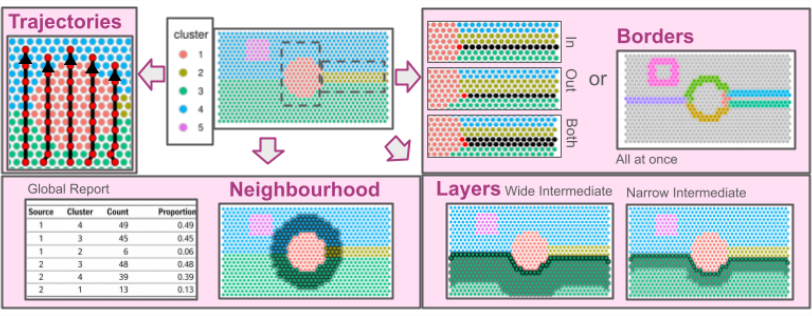
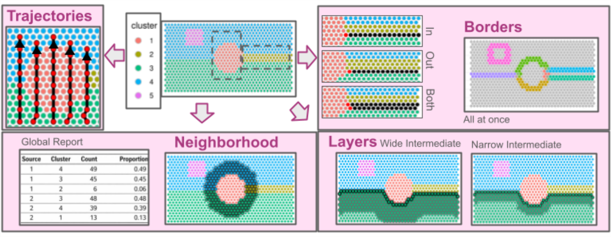

# Battlefield 
	
<br/>
<br/>

## Overview

 **Battlefield** is a Swiss-army toolkit designed to define
and extract spatial spots from specific regions
in spatial transcriptomics data.
</br></br>
It provides low-level, modular utilities to delineate
spatial regions of interest,  
including **interfaces between clusters**, **intra-cluster layers**, and  
**inter-cluster trajectories**.
</br></br>
These utilities are intended to be reused and composed within higher-level  
analytical workflows and packages.
</br></br>
`Battlefield` supports sequencing-based spatial transcriptomics platforms such as  
**10x Genomics Visium**, across multiple resolutions, including  
Visium HD (binned).



 **Battlefield** provides four core functionalities to define and extract 
spatial transcriptomics spots from specific tissue regions, enabling 
the study of spatial organization under different biological contexts:

* **Interfaces between clusters** — identify and analyze boundary 
regions where distinct tissue or cell populations interact.

* **Intra-cluster layers** — characterize spatial layers
or gradients within a single cluster.

* **Inter-cluster trajectories**  — model spatial transitions 
across multiple clusters.

* **Cluster neighbourhood**  — report the cluster composition 
of a spatial neighborhood defined by k nearest spots, 
constrained by a distance threshold.

It can be integrated upstream to 
support insightful ligand–receptor analyses, 
using BulkSignalR, available from Bioconductor 
[here](https://www.bioconductor.org/packages/release/bioc/html/BulkSignalR.html).  

Data summary functions are proposed to
help defining spatial regions of interest on the top of previously defined 
clusters.

## Installation

``` R

# Battlefield directly from Bioconductor.
if (!require("BiocManager", quietly = TRUE))
    install.packages("BiocManager")
BiocManager::install("Battlefield")

# or development version via GitHub:
# install.packages("devtools")
devtools::install_github("ZheFrench/Battlefield",build_vignettes = TRUE)

# To read the vignette
# browseVignettes("Battlefield")

```

## Changes

Major changes are reported in the [NEWS file](https://github.com/ZheFrench/Battlefield/blob/master/NEWS), make sure to check it out if you want to follow the latest developments.

## Issues and bug reports
Please use https://github.com/ZheFrench/Battlefield/issues to submit issues, bug reports, and comments.


**Battlefield** has been successfully installed on Mac OS X, Linux, and Windows using R version 4.5.


The code in this repository is published with the [CeCILL](https://github.com/ZheFrench/Battlefield/blob/master/LICENSE.md) License.


<!-- badges: start -->
[](https://shields.io/)
<!-- badges: end -->


