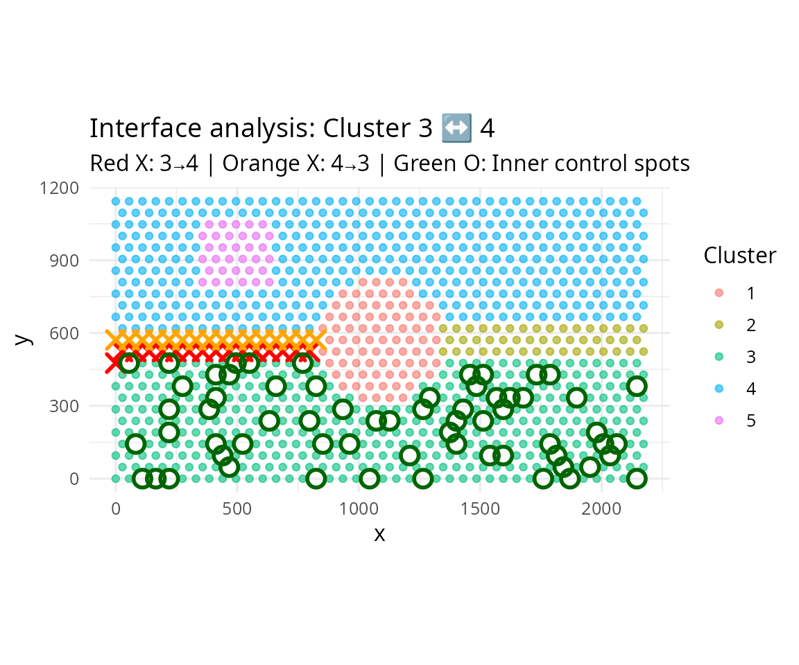
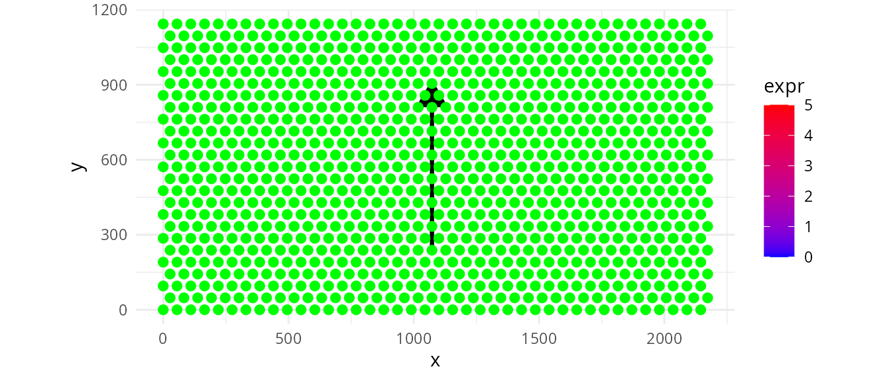
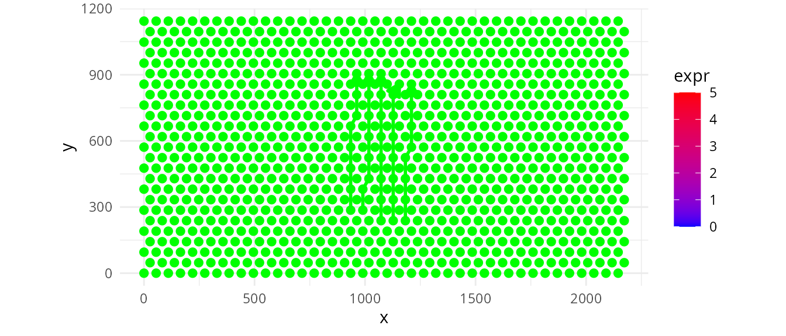
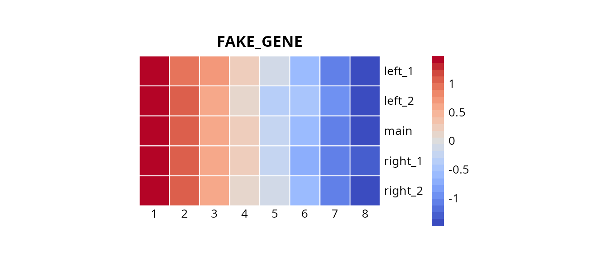

# Battlefield

Abstract

`Battlefield` is a **Swiss-army toolkit designed to define and extract
spatial spots from specific regions in spatial transcriptomics data.**
It provides low-level, modular utilities to delineate spatial regions of
interest, including **interfaces between clusters**, **intra-cluster
layers**, and **inter-cluster trajectories**. These utilities are
intended to be reused and composed within higher-level analytical
workflows and packages. `Battlefield` supports sequencing-based spatial
transcriptomics platforms such as **10x Genomics Visium**, across
multiple resolutions, including Visium HD (binned). Battlefield package
version: 0.99.1

``` r
library(Battlefield)
library(SpatialExperiment)
library(ggplot2)
library(dplyr)
library(tidyr)
library(pheatmap)
library(pals)
library(grid)
library(patchwork)
```

## Introduction

`Battlefield` is a **Swiss-army toolkit designed to define and extract
spatial spots from specific regions in spatial transcriptomics data.**
It provides low-level, modular utilities to delineate spatial regions of
interest,  
including **interfaces between clusters**, **intra-cluster layers**,
and  
**inter-cluster trajectories**. These utilities are intended to be
reused and composed within higher-level  
analytical workflows and packages. `Battlefield` supports
sequencing-based spatial transcriptomics platforms such as  
**10x Genomics Visium**, across multiple resolutions, including  
Visium HD (binned).

## What is it for?

`Battlefield` provides four core functionalities to define and extract
spatial transcriptomics spots from specific tissue regions, enabling the
study of spatial organization under different biological contexts:

- **Interfaces between clusters** — identify and analyze boundary
  regions where distinct tissue or cell populations interact.

- **Intra-cluster layers** — characterize spatial layers or gradients
  within a single cluster.

- **Inter-cluster trajectories** — model spatial transitions across
  multiple clusters.

- **Cluster neighbourhood** — report the cluster composition of a
  spatial neighborhood defined by k nearest spots, constrained by a
  distance threshold.

## Starting point

We start from a SpatialExperiment object that contains (i) spatial
coordinates for each spot and (ii) a precomputed clustering stored in
colData(). Battlefield operates on a simple spot-level table, so we
first export a data.frame with four columns: \* spot_id: spot/barcode
identifier (colnames(spe)) \* x, y: spatial coordinates
(spatialCoords(spe)) \* cluster: cluster label provided by the user (a
column in colData(spe)) Because the cluster annotation can have
different names depending on the workflow (e.g., cluster,
seurat_clusters, BayesSpace, etc.), the user can specify which colData()
column should be used.

### Interfaces between clusters

Battlefield allows you to identify and extract **spatial interfaces**
between clusters (also known as `invasive margins`, or
`niche boundaries`). Here we demonstrate how to:

1.  Detect interfaces between two specific clusters
    (inside/outside/both)
2.  Identify multi-interface spots (belonging to several interfaces)
3.  Select all interfaces at once
4.  Detect associated inner control spots

We load a simulated Visium dataset (hexagonal grid) to illustrate the
different functionalities.

#### Simulated Standard Visium -hexagonal grid

#### Simulated VisiumHD -square grid

#### Real life example

``` r
# Load VisiumHD data at 16 µm resolution
data("visiumHD_16um_simulated_spe")

df <- data.frame(
spot_id = colnames(visiumHD_16um_simulated_spe),
x = spatialCoords(visiumHD_16um_simulated_spe)[, 1],
y = spatialCoords(visiumHD_16um_simulated_spe)[, 2],
cluster = colData(visiumHD_16um_simulated_spe)$cluster
)
```

``` r
# Get all directed cluster pairs
pairs <- directed_cluster_interface_pairs(df$cluster)
head(pairs)
```

    ##   cluster interface directed_pair
    ## 1       4         3           4-3
    ## 2       5         3           5-3
    ## 3       1         3           1-3
    ## 4       2         3           2-3
    ## 5       3         4           3-4
    ## 6       5         4           5-4

``` r
# Detect grid type and get parameters
res <- detect_grid_type(df, verbose = FALSE)
params <- get_neighborhood_params(df, square_connectivity = 4)
```

    ## ---- Grid type detection ----

    ## Estimated grid step: 400

    ## Median distance ratio: 1.414

    ## Detected grid type: square

    ## --------------------------------

    ## ---- Neighborhood parameters ----

    ## grid_type: square

    ## connectivity: 4

    ## radius: 404

    ## k: 16

    ## comment: Visium HD: 4-connectivity (square grid)

    ## --------------------------------

``` r
# Select specific interface: cluster 5 → 4
border_in <- select_border_spots(df, cluster = 5, interface = 4, k = 4)

knitr::kable(head(border_in))
```

|     | spot_id   |    x |    y | directed_pair | undirected_pair | cluster | interface | is_border | is_border_multiple | other_adjacent_borders | mode  |
|:----|:----------|-----:|-----:|:--------------|:----------------|:--------|----------:|:----------|:-------------------|:-----------------------|:------|
| 168 | bin16_687 | 2400 | 6800 | 5-4           | 4-5 / 5-4       | 5       |         4 | TRUE      | FALSE              | NA                     | inner |
| 170 | bin16_767 | 2400 | 7600 | 5-4           | 4-5 / 5-4       | 5       |         4 | TRUE      | FALSE              | NA                     | inner |
| 172 | bin16_847 | 2400 | 8400 | 5-4           | 4-5 / 5-4       | 5       |         4 | TRUE      | FALSE              | NA                     | inner |
| 193 | bin16_688 | 2800 | 6800 | 5-4           | 4-5 / 5-4       | 5       |         4 | TRUE      | FALSE              | NA                     | inner |
| 194 | bin16_728 | 2800 | 7200 | 5-4           | 4-5 / 5-4       | 5       |         4 | TRUE      | FALSE              | NA                     | inner |
| 196 | bin16_808 | 2800 | 8000 | 5-4           | 4-5 / 5-4       | 5       |         4 | TRUE      | FALSE              | NA                     | inner |

``` r
df_in <- df |>
mutate(is_border = spot_id %in% border_in$spot_id) |>
left_join(border_in |> select(spot_id, is_border_multiple),
            by = "spot_id") |>
mutate(is_border_multiple = coalesce(is_border_multiple, FALSE))

# Plot interface 5 → 4
p_in <- ggplot(df_in, aes(x, y, color = cluster)) +
geom_point(size = 1) +
geom_point(data = subset(df_in, is_border & !is_border_multiple),
            color = "black", size = 2) +
geom_point(data = subset(df_in, is_border & is_border_multiple),
            color = "red", size = 2) +
coord_equal() +
theme_minimal() +
labs(title = "Cluster: 5 → 4")

# Select reverse interface: cluster 4 → 5
border_out <- select_border_spots(df, cluster = 4, interface = 5, k = 4)

df_out <- df |>
mutate(is_border = spot_id %in% border_out$spot_id) |>
left_join(border_out |> select(spot_id, is_border_multiple),
            by = "spot_id") |>
mutate(is_border_multiple = coalesce(is_border_multiple, FALSE))


# Plot interface 4 → 5
p_out <- ggplot(df_out, aes(x, y, color = cluster)) +
geom_point(size = 1) +
geom_point(data = subset(df_out, is_border & !is_border_multiple),
            color = "black", size = 2) +
geom_point(data = subset(df_out, is_border & is_border_multiple),
            color = "red", size = 2) +
coord_equal() +
theme_minimal() +
labs(title = "Interface: 4 → 5")

# Combine both interfaces side by side
p_in | p_out
```


#### All interfaces overview

``` r
# Build all borders for all directed pairs
big_border_df <- build_all_borders(df, k = 4, pairs = pairs)

# Create undirected pair visualization
df_all <- df |>
left_join(big_border_df |> select(spot_id, undirected_pair, is_border_multiple),
            by = "spot_id") |>
mutate(is_border = !is.na(undirected_pair),
        is_border_multiple = coalesce(is_border_multiple, FALSE))

# Plot all interfaces colored by undirected pair
ggplot(df_all, aes(x, y)) +
geom_point(data = subset(df_all, !is_border),
            color = "gray", size = 1) +
geom_point(data = subset(df_all, is_border & is_border_multiple),
            aes(color = undirected_pair), size = 2, alpha = 0.4) +
geom_point(data = subset(df_all, is_border & !is_border_multiple),
            aes(color = undirected_pair), size = 2) +
coord_equal() +
theme_minimal() +
labs(title = "All cluster interfaces (undirected pairs)",
    subtitle = "Light color: multi-interface spots | Full color: pure interface")
```


#### Standard Visium Simulated

``` r
# Load standard Visium data at lower resolution
data("visium_simulated_spe")

df_visium <- data.frame(
spot_id = colnames(visium_simulated_spe),
x = spatialCoords(visium_simulated_spe)[, 1],
y = spatialCoords(visium_simulated_spe)[, 2],
cluster = colData(visium_simulated_spe)$cluster
)

# Get all pairs and detect grid
pairs_visium <- directed_cluster_interface_pairs(df_visium$cluster)
params_visium <- get_neighborhood_params(df_visium, verbose = FALSE)

# Define cluster pair of interest
cluster_A <- 3
cluster_B <- 4

# Select border spots for both directions
border_A_to_B <- subset(
build_all_borders(df_visium, k = 6, pairs = pairs_visium),
cluster == cluster_A & interface == cluster_B
)

border_B_to_A <- subset(
build_all_borders(df_visium, k = 6, pairs = pairs_visium),
cluster == cluster_B & interface == cluster_A
)

# Build all borders to identify inner spots
all_borders_visium <- build_all_borders(df_visium, k = 6, pairs = pairs_visium)

# Select inner spots for cluster A
set.seed(42)
inner_A <- select_core_spots(df_visium, all_borders_visium, 
                            cluster = cluster_A, interface = cluster_B, 
                            mode = "both")

# Create visualization dataframe with spot classification
df_final <- df_visium |>
mutate(spot_type = "background") |>
mutate(spot_type = ifelse(spot_id %in% border_A_to_B$spot_id, 
                            "border_A_to_B", spot_type)) |>
mutate(spot_type = ifelse(spot_id %in% border_B_to_A$spot_id, 
                            "border_B_to_A", spot_type)) |>
mutate(spot_type = ifelse(spot_id %in% inner_A$spot_id, 
                            "inner_A", spot_type)) |>
as.data.frame()

# Plot: clusters with borders and inner control spots
ggplot(df_final, aes(x, y, color = cluster)) +
geom_point(data = subset(df_final, spot_type == "background"), 
            size = 1.5, alpha = 0.6) +
geom_point(data = subset(df_final, spot_type == "border_A_to_B"), 
            color = "red", size = 3.5, shape = 4, stroke = 1.5) +
geom_point(data = subset(df_final, spot_type == "border_B_to_A"),
            color = "orange", size = 3.5, shape = 4, stroke = 1.5) +
geom_point(data = subset(df_final, spot_type == "inner_A"), 
            aes(color = NULL), 
            color = "darkgreen", size = 3.5, shape = 1, stroke = 1.5) +
coord_equal() +
theme_minimal(base_size = 12) +
labs(
    title = paste0("Interface analysis: Cluster ", cluster_A, " ↔ ", cluster_B),
    subtitle = paste0("Red X: ", cluster_A, "→", cluster_B, " | Orange X: ", cluster_B, "→", cluster_A, " | Green O: Inner control spots"),
    x = "x", y = "y", color = "Cluster"
)
```



### Intra-cluster layers

### Inter-cluster trajectories

Here

``` r
data("visium_simulated_spe")
head("visium_simulated_spe")
```

    ## [1] "visium_simulated_spe"

``` r
set.seed(12)

head(colData(visium_simulated_spe))
```

    ## DataFrame with 6 rows and 3 columns
    ##           barcode_id  cluster   sample_id
    ##          <character> <factor> <character>
    ## SPOT0001    SPOT0001        3    sample01
    ## SPOT0002    SPOT0002        3    sample01
    ## SPOT0003    SPOT0003        3    sample01
    ## SPOT0004    SPOT0004        3    sample01
    ## SPOT0005    SPOT0005        3    sample01
    ## SPOT0006    SPOT0006        3    sample01

``` r
df <- data.frame(
spot_id = colnames(visium_simulated_spe),
x = spatialCoords(visium_simulated_spe)[, 1],
y = spatialCoords(visium_simulated_spe)[, 2],
cluster = colData(visium_simulated_spe)$cluster
)

expr <- as.numeric(assay(visium_simulated_spe, "counts")["FAKE_GENE", ])
test <- cbind(as.data.frame(colData(visium_simulated_spe)), df[, c("x", "y"), drop = FALSE])
test$expr <- expr


start_cluster <- "3"
end_cluster   <- "4"
top_n <- 8

centroids <- compute_centroids(df)

A <- centroids[centroids$cluster == start_cluster, c("x","y")]
B <- centroids[centroids$cluster == end_cluster,   c("x","y")]


(res <- build_one_trajectory(df, A, B, top_n = top_n, max_dist = NULL))
```

    ##    spot_id      x        y cluster dist_to_seg pos_on_seg trajectory_id
    ## 1 SPOT0220 1072.5 238.1570       3  11.5795728 0.00275319          main
    ## 2 SPOT0300 1072.5 333.4198       1   8.6442774 0.14803792          main
    ## 3 SPOT0380 1072.5 428.6826       1   5.7089820 0.29332266          main
    ## 4 SPOT0460 1072.5 523.9454       1   2.7736866 0.43860739          main
    ## 5 SPOT0540 1072.5 619.2082       1   0.1616088 0.58389212          main
    ## 6 SPOT0620 1072.5 714.4710       1   3.0969042 0.72917686          main
    ## 7 SPOT0700 1072.5 809.7338       1   6.0321996 0.87446159          main
    ## 8 SPOT0780 1072.5 904.9965       4  15.7447575 1.00000000          main

``` r
ggplot(test, aes(x, y)) +
geom_point(aes(color = expr),size = 1.6, alpha = 0.85) +
scale_color_gradient(
low = "blue",
high = "red"
) +
geom_path(
data = res,
aes(x = x, y = y),
color = "green", linewidth = 1.1
) +
geom_path(
data = res,
aes(x = x, y = y),
color = "black", linewidth = 1.1,
arrow = grid::arrow(type = "closed",
length = grid::unit(5, "mm"))
) +
geom_point(data = res$selected, aes(x, y), 
inherit.aes = FALSE, size = 2.2, color="green") +
coord_equal() +
theme_minimal()
```



``` r
(out <- build_similar_trajectories(df, A, B, top_n = top_n, n_extra = 2, side = "both"))
```

    ##     spot_id      x        y cluster dist_to_seg  pos_on_seg trajectory_id
    ## 1  SPOT0220 1072.5 238.1570       3  11.5795728 0.002753190          main
    ## 2  SPOT0300 1072.5 333.4198       1   8.6442774 0.148037923          main
    ## 3  SPOT0380 1072.5 428.6826       1   5.7089820 0.293322657          main
    ## 4  SPOT0460 1072.5 523.9454       1   2.7736866 0.438607390          main
    ## 5  SPOT0540 1072.5 619.2082       1   0.1616088 0.583892123          main
    ## 6  SPOT0620 1072.5 714.4710       1   3.0969042 0.729176857          main
    ## 7  SPOT0700 1072.5 809.7338       1   6.0321996 0.874461590          main
    ## 8  SPOT0780 1072.5 904.9965       4  15.7447575 1.000000000          main
    ## 9  SPOT0259  990.0 285.7884       3   9.0989022 0.071516864        left_1
    ## 10 SPOT0339  990.0 381.0512       1  12.0341976 0.216801597        left_1
    ## 11 SPOT0379 1017.5 428.6826       1  13.9850971 0.290736861        left_1
    ## 12 SPOT0459 1017.5 523.9454       1  11.0498017 0.436021595        left_1
    ## 13 SPOT0539 1017.5 619.2082       1   8.1145063 0.581306328        left_1
    ## 14 SPOT0619 1017.5 714.4710       1   5.1792109 0.726591062        left_1
    ## 15 SPOT0699 1017.5 809.7338       1   2.2439155 0.871875795        left_1
    ## 16 SPOT0779 1017.5 904.9965       4  11.2679986 1.000000000        left_1
    ## 17 SPOT0258  935.0 285.7884       3   0.8227870 0.068931069        left_2
    ## 18 SPOT0338  935.0 381.0512       1   3.7580824 0.214215802        left_2
    ## 19 SPOT0418  935.0 476.3140       1   6.6933778 0.359500535        left_2
    ## 20 SPOT0498  935.0 571.5768       1   9.6286732 0.504785269        left_2
    ## 21 SPOT0578  935.0 666.8396       1  12.5639686 0.650070002        left_2
    ## 22 SPOT0618  962.5 714.4710       1  13.4553261 0.724005266        left_2
    ## 23 SPOT0698  962.5 809.7338       4  10.5200307 0.869290000        left_2
    ## 24 SPOT0778  962.5 904.9965       4  12.1971444 1.000000000        left_2
    ## 25 SPOT0221 1127.5 238.1570       3   3.3034576 0.005338985       right_1
    ## 26 SPOT0301 1127.5 333.4198       1   0.3681622 0.150623718       right_1
    ## 27 SPOT0381 1127.5 428.6826       1   2.5671332 0.295908452       right_1
    ## 28 SPOT0461 1127.5 523.9454       1   5.5024286 0.441193185       right_1
    ## 29 SPOT0541 1127.5 619.2082       1   8.4377240 0.586477918       right_1
    ## 30 SPOT0621 1127.5 714.4710       1  11.3730194 0.731762652       right_1
    ## 31 SPOT0701 1127.5 809.7338       1  14.3083148 0.877047385       right_1
    ## 32 SPOT0742 1155.0 857.3651       4  11.7109799 0.950982649       right_1
    ## 33 SPOT0222 1182.5 238.1570       3   4.9726575 0.007924780       right_2
    ## 34 SPOT0302 1182.5 333.4198       1   7.9079529 0.153209513       right_2
    ## 35 SPOT0382 1182.5 428.6826       1  10.8432484 0.298494247       right_2
    ## 36 SPOT0462 1182.5 523.9454       1  13.7785438 0.443778980       right_2
    ## 37 SPOT0503 1210.0 571.5768       1  12.2407510 0.517714244       right_2
    ## 38 SPOT0583 1210.0 666.8396       1   9.3054555 0.662998978       right_2
    ## 39 SPOT0663 1210.0 762.1024       1   6.3701601 0.808283711       right_2
    ## 40 SPOT0743 1210.0 857.3651       4   3.4348647 0.953568445       right_2
    ##     offset
    ## 1     0.00
    ## 2     0.00
    ## 3     0.00
    ## 4     0.00
    ## 5     0.00
    ## 6     0.00
    ## 7     0.00
    ## 8     0.00
    ## 9    63.25
    ## 10   63.25
    ## 11   63.25
    ## 12   63.25
    ## 13   63.25
    ## 14   63.25
    ## 15   63.25
    ## 16   63.25
    ## 17  126.50
    ## 18  126.50
    ## 19  126.50
    ## 20  126.50
    ## 21  126.50
    ## 22  126.50
    ## 23  126.50
    ## 24  126.50
    ## 25  -63.25
    ## 26  -63.25
    ## 27  -63.25
    ## 28  -63.25
    ## 29  -63.25
    ## 30  -63.25
    ## 31  -63.25
    ## 32  -63.25
    ## 33 -126.50
    ## 34 -126.50
    ## 35 -126.50
    ## 36 -126.50
    ## 37 -126.50
    ## 38 -126.50
    ## 39 -126.50
    ## 40 -126.50

``` r
ggplot(test, aes(x, y)) +
geom_point(aes(color = expr),size = 1.6, alpha = 0.85) +
scale_color_gradient(
low = "blue",
high = "red"
) +
geom_path(data=out, aes(x=x, y=y, group=trajectory_id), 
inherit.aes = FALSE, color="green",linewidth=1,
arrow = grid::arrow(type = "closed", length = grid::unit(3, "mm"))) +
geom_point(data = out$lines, aes(x, y), 
inherit.aes = FALSE, size = 2.2, color="green") +
coord_equal() +
theme_minimal() 
```



``` r
meta <- out|>
transmute(
    spot_id = as.character(spot_id),
    trajectory = as.character(trajectory_id),
    progress = as.numeric(pos_on_seg)
) |>
group_by(trajectory) |>
arrange(progress, .by_group = TRUE) |>
mutate(
    index = seq_len(n())   # <- index 1..length ordered according to t
) |>
ungroup()

gene <- c("FAKE_GENE") 
expr <- assay(visium_simulated_spe, "counts")[gene, meta$spot_id]
meta$expr <- expr

mat <- meta |>
select(trajectory, index, expr) |>
tidyr::pivot_wider(names_from = index, values_from = expr) |>
as.data.frame()

rownames(mat) <- mat$trajectory
mat$trajectory <- NULL

pheatmap(
mat,
cluster_rows = FALSE,
cluster_cols = FALSE,
border_color = "white",
main = gene,angle_col=0,
col=pals::coolwarm(), scale="row",
cellwidth=25, cellheight=25 , na_col = "grey90"
)
```



## Session Information

``` r
sessionInfo()
```

    ## R Under development (unstable) (2025-12-18 r89199)
    ## Platform: x86_64-pc-linux-gnu
    ## Running under: Ubuntu 24.04.3 LTS
    ## 
    ## Matrix products: default
    ## BLAS:   /usr/lib/x86_64-linux-gnu/openblas-pthread/libblas.so.3 
    ## LAPACK: /usr/lib/x86_64-linux-gnu/openblas-pthread/libopenblasp-r0.3.26.so;  LAPACK version 3.12.0
    ## 
    ## locale:
    ##  [1] LC_CTYPE=en_US.UTF-8       LC_NUMERIC=C              
    ##  [3] LC_TIME=fr_FR.UTF-8        LC_COLLATE=en_US.UTF-8    
    ##  [5] LC_MONETARY=fr_FR.UTF-8    LC_MESSAGES=en_US.UTF-8   
    ##  [7] LC_PAPER=fr_FR.UTF-8       LC_NAME=C                 
    ##  [9] LC_ADDRESS=C               LC_TELEPHONE=C            
    ## [11] LC_MEASUREMENT=fr_FR.UTF-8 LC_IDENTIFICATION=C       
    ## 
    ## time zone: Europe/Paris
    ## tzcode source: system (glibc)
    ## 
    ## attached base packages:
    ## [1] grid      stats4    stats     graphics  grDevices utils     datasets 
    ## [8] methods   base     
    ## 
    ## other attached packages:
    ##  [1] patchwork_1.3.2             pals_1.10                  
    ##  [3] pheatmap_1.0.13             tidyr_1.3.2                
    ##  [5] dplyr_1.1.4                 ggplot2_4.0.1              
    ##  [7] SpatialExperiment_1.21.0    SingleCellExperiment_1.33.0
    ##  [9] SummarizedExperiment_1.41.0 Biobase_2.71.0             
    ## [11] GenomicRanges_1.63.1        Seqinfo_1.1.0              
    ## [13] IRanges_2.45.0              S4Vectors_0.49.0           
    ## [15] BiocGenerics_0.57.0         generics_0.1.4             
    ## [17] MatrixGenerics_1.23.0       matrixStats_1.5.0          
    ## [19] Battlefield_0.99.01        
    ## 
    ## loaded via a namespace (and not attached):
    ##  [1] gtable_0.3.6        rjson_0.2.23        xfun_0.55          
    ##  [4] bslib_0.9.0         htmlwidgets_1.6.4   lattice_0.22-7     
    ##  [7] vctrs_0.6.5         tools_4.6.0         tibble_3.3.0       
    ## [10] pkgconfig_2.0.3     Matrix_1.7-4        RColorBrewer_1.1-3 
    ## [13] S7_0.2.1            desc_1.4.3          lifecycle_1.0.5    
    ## [16] compiler_4.6.0      farver_2.1.2        textshaping_1.0.4  
    ## [19] mapproj_1.2.12      maps_3.4.3          htmltools_0.5.9    
    ## [22] sass_0.4.10         yaml_2.3.12         pillar_1.11.1      
    ## [25] pkgdown_2.2.0       jquerylib_0.1.4     DelayedArray_0.37.0
    ## [28] cachem_1.1.0        magick_2.9.0        abind_1.4-8        
    ## [31] tidyselect_1.2.1    digest_0.6.39       purrr_1.2.1        
    ## [34] labeling_0.4.3      fastmap_1.2.0       colorspace_2.1-2   
    ## [37] cli_3.6.5           SparseArray_1.11.10 magrittr_2.0.4     
    ## [40] S4Arrays_1.11.1     dichromat_2.0-0.1   withr_3.0.2        
    ## [43] scales_1.4.0        rmarkdown_2.30      XVector_0.51.0     
    ## [46] RANN_2.6.2          ragg_1.5.0          evaluate_1.0.5     
    ## [49] knitr_1.50          rlang_1.1.7         Rcpp_1.1.1         
    ## [52] glue_1.8.0          jsonlite_2.0.0      R6_2.6.1           
    ## [55] systemfonts_1.3.1   fs_1.6.6
