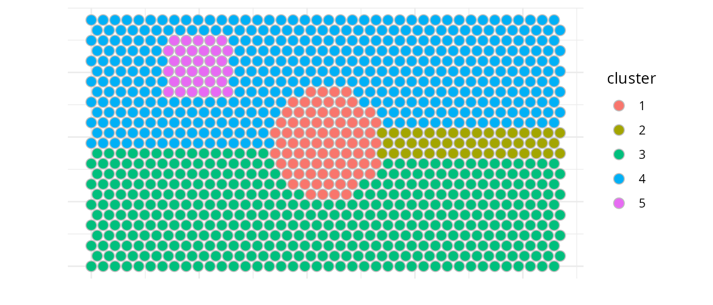
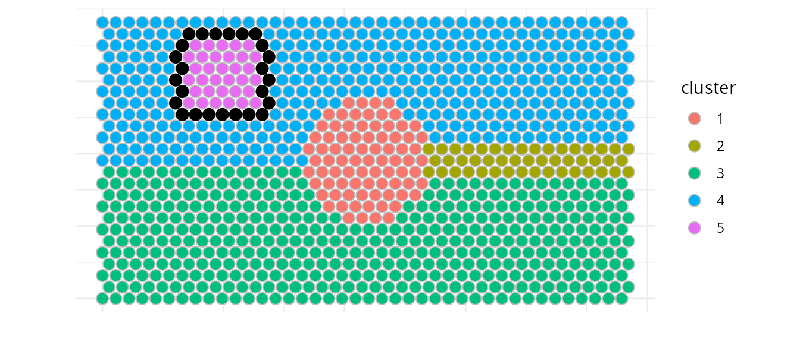
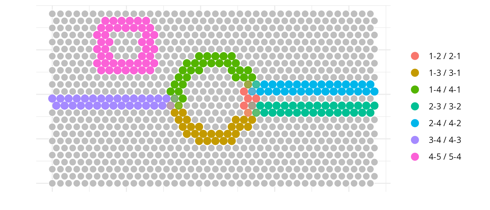
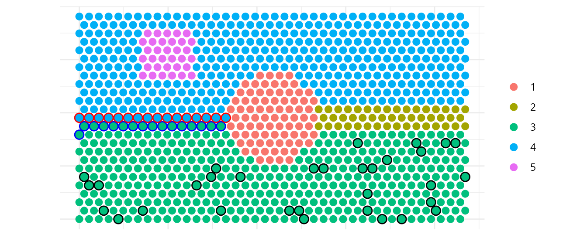
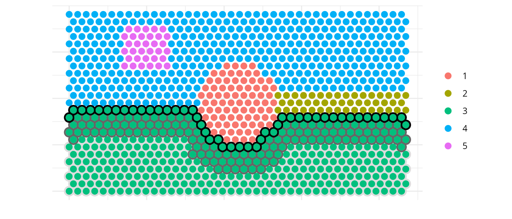
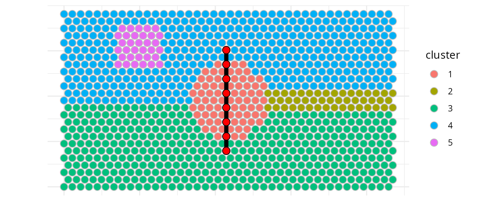
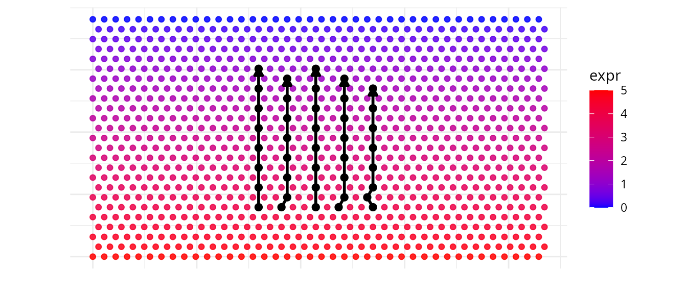
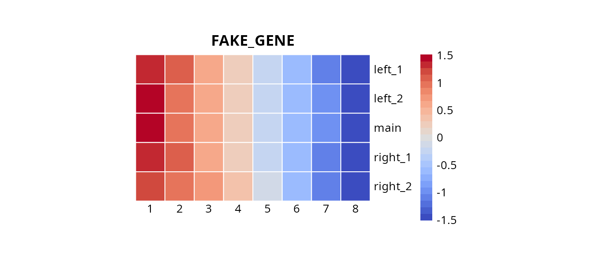
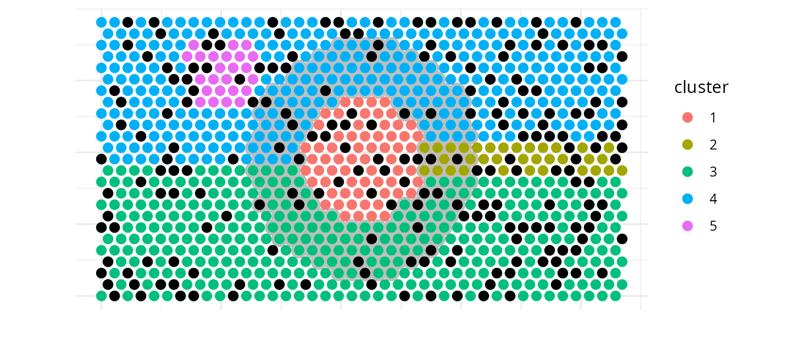

# Battlefield

Abstract

`Battlefield` is a **Swiss-army toolkit designed to define and extract
spatial spots from specific regions in spatial transcriptomics data.**
It provides low-level, modular utilities to delineate spatial regions of
interest, including **interfaces between clusters**, **intra-cluster
layers**, and **inter-cluster trajectories**. These utilities are
intended to be reused and composed within higher-level analytical
workflows and packages. `Battlefield` supports sequencing-based spatial
transcriptomics platforms such as **10x Genomics Visium**, across
multiple resolutions, including Visium HD (binned). Battlefield package
version: 0.99.1

``` r
library(Battlefield)
library(SpatialExperiment)
library(ggplot2)
library(dplyr)
library(tidyr)
library(pheatmap)
library(pals)
library(grid)
```

## Introduction

`Battlefield` is a **Swiss-army toolkit designed to define and extract
spatial spots from specific regions in spatial transcriptomics data.**
It provides low-level, modular utilities to delineate spatial regions of
interest,  
including **interfaces between clusters**, **intra-cluster layers**,
and  
**inter-cluster trajectories**. These utilities are intended to be
reused and composed within higher-level  
analytical workflows and packages. `Battlefield` supports
sequencing-based spatial transcriptomics platforms such as  
**10x Genomics Visium**, across multiple resolutions, including  
Visium HD (binned).

## What is it for?

`Battlefield` provides four core functionalities to define and extract
spatial transcriptomics spots from specific tissue regions, enabling the
study of spatial organization under different biological contexts:

- **Interfaces between clusters** — identify and analyze boundary
  regions where distinct tissue or cell populations interact.

- **Intra-cluster layers** — characterize spatial layers or gradients
  within a single cluster.

- **Inter/Intra-cluster trajectories** — model spatial transitions
  across multiple clusters.

- **Spatial neighborhood** — report the cluster composition of a spatial
  neighborhood defined by k nearest spots, constrained by a distance
  threshold.

Finally, you can integrate `Battlefield` results back into a
`SpatialExperiment` object for further analysis.

## Starting point

We start from a `SpatialExperiment` object that contains **(i)** spatial
coordinates for each spot and **(ii)** a precomputed clustering stored
in colData().

Battlefield operates on a simple spot-level table, so we first export a
data.frame with four columns:

- spot_id: spot/barcode identifier (colnames(spe))  
- x, y: spatial coordinates (spatialCoords(spe))  
- cluster: cluster label provided by the user (a column in colData(spe))

Because the cluster annotation can have different names depending on the
workflow (e.g., cluster, seurat_clusters, BayesSpace, etc.), the user
can specify which colData() column should be used.

We load a simulated Visium dataset (hexagonal grid) to illustrate the
different functionalities that Battlefield provides.

``` r
# Load Visium data 
data("visium_simulated_spe")

df <- data.frame(
spot_id = colnames(visium_simulated_spe),
x = spatialCoords(visium_simulated_spe)[, 1],
y = spatialCoords(visium_simulated_spe)[, 2],
cluster = colData(visium_simulated_spe)$cluster
)

# Plot cluster distribution
ggplot(df, aes(x, y, fill = cluster)) +
geom_point(size = 3.2,colour = "grey", shape = 21) +
coord_equal() +
theme_minimal()+
labs(x = "", y = "") +
theme(axis.text = element_blank()) 
```



You can have acces to some basic information about the dataset you are
using (grid type, distance threshold (radius) advised…)

``` r
# Detect grid type and get parameters
res <- detect_grid_type(df, verbose = TRUE)
```

    ## ---- Grid type detection ----

    ## Estimated grid step: 55

    ## Median distance ratio: 1.732

    ## Detected grid type: hexagonal

    ## --------------------------------

``` r
params <- get_neighborhood_params(df, verbose = TRUE)
```

    ## ---- Neighborhood parameters ----

    ## grid_type: hexagonal

    ## connectivity: 6

    ## radius: 55.55

    ## k: 6

    ## comment: Standard Visium: 6 hexagonal neighbors

    ## --------------------------------

### Interfaces between clusters

Battlefield allows you to identify and extract **spatial interfaces**
between clusters. Here we demonstrate how to:

1.  Detect interfaces between two specific clusters (according to three
    modes of selection called `inner`, `outer` or `both`)
2.  Identify multi-interface spots all at once
3.  Detect a same number of control spots relative to the cluster of
    interest

`Battlefield` offers several functionalities related to interfaces (aka
borders) via the following fonctions metionned below:

- `select_border_spots`, between two clusters according to a specified
  mode
- `build_all_borders`
- `select_core_spots` , to select control spots within a cluster
  relative to its border
- `build_all_cores`

You must have first defined borders before selecting core spots.

Here we show an example to detect interfaces between clusters 4 and 5.
We identify border spots from cluster 4 that are adjacent to cluster 5,
referenced as interface for the adjactent cluster.  
We used the `inner` mode to select spots, meaning that only spots from
cluster 4 that are located in the inside of the cluster towards cluster
5 (the interface) are selected.

Note : we used a `max_dist = 60` microns to define the spatial
neighborhood to remove spots that would have been too far away to be
considered as neighbors.

``` r
border_in <- select_border_spots(df, 
    cluster = 4, 
    interface = 5,
    mode = "inner",
    max_dist = 60)
# A similar approach would have been 
# select_border_spots(df, 
#   cluster = 5, 
#   interface = 4,
#   mode = "outer",
#   max_dist = 60)
knitr::kable(head(border_in))
```

|     | spot_id  |   x |        y | directed_pair | undirected_pair | cluster | interface | is_border | is_border_multiple | other_adjacent_borders | mode  |
|:----|:---------|----:|---------:|:--------------|:----------------|:--------|----------:|:----------|:-------------------|:-----------------------|:------|
| 647 | SPOT0647 | 330 | 762.1024 | 4-5           | 4-5 / 5-4       | 4       |         5 | TRUE      | FALSE              | NA                     | inner |
| 648 | SPOT0648 | 385 | 762.1024 | 4-5           | 4-5 / 5-4       | 4       |         5 | TRUE      | FALSE              | NA                     | inner |
| 649 | SPOT0649 | 440 | 762.1024 | 4-5           | 4-5 / 5-4       | 4       |         5 | TRUE      | FALSE              | NA                     | inner |
| 650 | SPOT0650 | 495 | 762.1024 | 4-5           | 4-5 / 5-4       | 4       |         5 | TRUE      | FALSE              | NA                     | inner |
| 651 | SPOT0651 | 550 | 762.1024 | 4-5           | 4-5 / 5-4       | 4       |         5 | TRUE      | FALSE              | NA                     | inner |
| 652 | SPOT0652 | 605 | 762.1024 | 4-5           | 4-5 / 5-4       | 4       |         5 | TRUE      | FALSE              | NA                     | inner |

``` r
# Structre data 
df_in <- df |>
mutate(is_border = spot_id %in% border_in$spot_id) |>
left_join(border_in |> 
select(spot_id, is_border_multiple),by = "spot_id") |>
mutate(is_border_multiple = coalesce(is_border_multiple, FALSE))


# Plot interface 5 → 4
ggplot(df_in, aes(x, y, fill = cluster)) +
geom_point(size = 3.2, shape = 21, colour = "grey") +
geom_point(data = subset(df_in, is_border & !is_border_multiple),
          size = 3.2,  colour = "black", fill = NA) +
geom_point(data = subset(df_in, is_border & is_border_multiple),
          size = 3.2,  colour = "red", fill = NA) +
coord_equal() +
theme_minimal()+
labs(x = "", y = "") +
theme(axis.text = element_blank()) 
```



We can also identify all interfaces at once and visualize spots that are
part of multiple interfaces. Here we used again a `max_dist = 60`
microns and `k = 6` neighbors to define the spatial neighborhood.

`is_border_multiple` indicates whether a spot is part of multiple
interfaces and is plotted with a different alpha in the example.

This approach needs further manual selection of the cluster pair of
interest as it brings some redundacy. (for example, border spots for
both directions 3→4 and 4→3 are identified twice due to sequencial call
of `select_border_spots` with the two modes (inner/outer)).

``` r
all_borders <- build_all_borders(df,max_dist = 60 , k = 6)
knitr::kable(head(all_borders))
```

| spot_id  |      x |        y | directed_pair | undirected_pair | cluster | interface | is_border | is_border_multiple | other_adjacent_borders | mode  |
|:---------|-------:|---------:|:--------------|:----------------|:--------|:----------|:----------|:-------------------|:-----------------------|:------|
| SPOT0299 | 1017.5 | 333.4198 | 1-3           | 1-3 / 3-1       | 1       | 3         | TRUE      | FALSE              | NA                     | inner |
| SPOT0300 | 1072.5 | 333.4198 | 1-3           | 1-3 / 3-1       | 1       | 3         | TRUE      | FALSE              | NA                     | inner |
| SPOT0301 | 1127.5 | 333.4198 | 1-3           | 1-3 / 3-1       | 1       | 3         | TRUE      | FALSE              | NA                     | inner |
| SPOT0302 | 1182.5 | 333.4198 | 1-3           | 1-3 / 3-1       | 1       | 3         | TRUE      | FALSE              | NA                     | inner |
| SPOT0338 |  935.0 | 381.0512 | 1-3           | 1-3 / 3-1       | 1       | 3         | TRUE      | FALSE              | NA                     | inner |
| SPOT0339 |  990.0 | 381.0512 | 1-3           | 1-3 / 3-1       | 1       | 3         | TRUE      | FALSE              | NA                     | inner |

``` r
# Structure data 
df2 <- df |>
left_join(all_borders |> 
select(spot_id, undirected_pair, is_border_multiple),by = "spot_id") |>
mutate(is_border = !is.na(undirected_pair),
    is_border_multiple = coalesce(is_border_multiple, FALSE))

# Plot all interfaces
ggplot(df2, aes(x, y)) +
geom_point(data = subset(df2, !is_border),
           fill="grey" ,colour = "white", size = 3.2,shape = 21) +
geom_point(data = subset(df2, is_border & is_border_multiple),
            aes(color = undirected_pair), size = 3.2, alpha = 0.4) +
geom_point(data = subset(df2, is_border & !is_border_multiple),
            aes(color = undirected_pair), size = 3.2) +
coord_equal() +
theme_minimal()+
labs(x = "", y = "",color = "") +
theme(axis.text = element_blank()) 
```



Next, we plot the different types of spots identified for the interface
between clusters 3 and 4. We identify border spots for both directions
(3→4 and 4→3) and a relative selection of core spots within cluster 3
that can be used as control spots for further analysis.

``` r
# Get all pairs and detect grid
pairs_visium <- directed_cluster_interface_pairs(df$cluster)
params_visium <- get_neighborhood_params(df, verbose = FALSE)

# Define cluster pair of interest
cluster_A <- 3
cluster_B <- 4

# Build all borders to identify inner spots
all_borders_visium <- build_all_borders(df, k = 6, pairs = pairs_visium)

# Select border spots for both directions
border_A_to_B <- subset(all_borders_visium,
cluster == cluster_A & interface == cluster_B
)

border_B_to_A <- subset(all_borders_visium,
cluster == cluster_B & interface == cluster_A
)


# Select inner spots for cluster A
inner_A <- select_core_spots(df, all_borders_visium, 
                            cluster = cluster_A, 
                            interface = cluster_B, 
                            mode = "both")

# Create visualization dataframe with spot classification
df_final <- df |>
mutate(spot_type = "background") |>
mutate(spot_type = ifelse(spot_id %in% border_A_to_B$spot_id, 
                            "border_A_to_B", spot_type)) |>
mutate(spot_type = ifelse(spot_id %in% border_B_to_A$spot_id, 
                            "border_B_to_A", spot_type)) |>
mutate(spot_type = ifelse(spot_id %in% inner_A$spot_id, 
                            "inner_A", spot_type)) |>
as.data.frame()


# Plot: clusters with borders and core control spots
ggplot(df_final, aes(x, y)) +
# 1) Base clusters           fill="gray" ,colour = "grey", size = 3.2,shape = 21) + # nolint: line_length_linter.
geom_point(aes(color = cluster), size = 2.5) +
#  2) Draw outlines (slightly larger) so they "surround" without hiding
geom_point(data = subset(df_final, spot_type == "border_A_to_B"), 
  color = "blue", size = 2.5, shape = 1, stroke = 1.25) +
geom_point(data = subset(df_final, spot_type == "border_B_to_A"),
  color = "red", size = 2.5, shape = 1, stroke = 1.25) +
geom_point(data = subset(df_final, spot_type == "inner_A"), 
  color = "black", size = 2.5, shape = 1, stroke = 1.25) +
  # 3) Re-draw the colored points ON TOP for the highlighted subset
geom_point(
  data = subset(df_final, spot_type %in% c("border_A_to_B", "border_B_to_A", "inner_A")),
  aes(color = cluster),
  size = 2.5
) +
coord_equal() +
theme_minimal() +
labs(x = "", y = "",color = "") +
theme(axis.text = element_blank())
```



### Intra-cluster layers

You can directly work on a specific cluster to define three layers as
core, intermediate and border.  
`intermediate_quantile` allows to control the thickness of the
intermediate layer.

``` r
target_cluster <- 3
# Narrow intermediate layer
layers_df <- create_cluster_layers(df, 
              target_cluster = target_cluster, 
              intermediate_quantile = 0.33)
# Create visualization dataframe
df_viz <- df |>
mutate(layer = NA_character_) |>
as.data.frame()

# Map layers to the full dataset
idx_match <- match(layers_df$spot_id, df_viz$spot_id)
valid_idx <- !is.na(idx_match)
df_viz$layer[idx_match[valid_idx]] <- layers_df$layer[valid_idx]

# Create combined plot: clusters in background + layers overlay with circles
ggplot(df_viz, aes(x, y)) +
# base clusters
geom_point(aes(color = cluster), size = 2.5) +
# 2) Draw outlines (slightly larger) so they "surround" without hiding
geom_point(
    data = subset(df_viz, layer == "core"),
    shape = 1, color = "#DDDDDD",
    size = 3.2, stroke = 1.25
) +
geom_point(
    data = subset(df_viz, layer == "intermediate"),
    shape = 1, color = "#666666",
    size = 3.2, stroke = 1.25
) +
geom_point(
    data = subset(df_viz, layer == "border"),
    shape = 1, color ="black",
    size = 3.2, stroke = 1.25
) +
# 3) Re-draw the colored points ON TOP for the highlighted subset
geom_point(
    data = subset(df_viz, layer %in% c("core", "intermediate", "border")),
    aes(color = cluster),
    size = 2.5
)  +
coord_equal() +
theme_minimal()+  labs(
  x = "", y = "", color = ""
) +
theme(
  axis.text = element_blank()
) 
```



### Inter/Intra-cluster trajectories

We can also identify spatial trajectories between two spots from two
cluster or inside a single cluster.

Here we demonstrate how to build a trajectory between clusters 3 and 4
using
[`build_one_trajectory()`](https://zhefrench.github.io/Battlefield/reference/build_one_trajectory.md).

``` r
# We retrieve expression for later visualization
expr <- as.numeric(assay(visium_simulated_spe, "counts")["FAKE_GENE", ])
test <- cbind(as.data.frame(colData(visium_simulated_spe)), df[, c("x", "y"), drop = FALSE])
test$expr <- expr

start_cluster <- "3"
end_cluster   <- "4"
top_n <- 8

centroids <- compute_centroids(df)

A <- centroids[centroids$cluster == start_cluster, c("x","y")]
B <- centroids[centroids$cluster == end_cluster,   c("x","y")]

res <- build_one_trajectory(df, A, B, top_n = top_n, max_dist = NULL)

knitr::kable(head(res))
```

| spot_id  |      x |        y | cluster | dist_to_seg | pos_on_seg | trajectory_id |
|:---------|-------:|---------:|:--------|------------:|-----------:|:--------------|
| SPOT0220 | 1072.5 | 238.1570 | 3       |  11.5795728 |  0.0027532 | main          |
| SPOT0300 | 1072.5 | 333.4198 | 1       |   8.6442774 |  0.1480379 | main          |
| SPOT0380 | 1072.5 | 428.6826 | 1       |   5.7089820 |  0.2933227 | main          |
| SPOT0460 | 1072.5 | 523.9454 | 1       |   2.7736866 |  0.4386074 | main          |
| SPOT0540 | 1072.5 | 619.2082 | 1       |   0.1616088 |  0.5838921 | main          |
| SPOT0620 | 1072.5 | 714.4710 | 1       |   3.0969042 |  0.7291769 | main          |

``` r
# Plot cluster distribution
ggplot(test, aes(x, y, fill = cluster)) +
geom_point(size = 3.2,colour="grey", shape = 21) +
geom_path(data=res, aes(x=x, y=y, group=trajectory_id), 
  color="black",linewidth=2) +
geom_point(data = res, aes(x, y), 
  size = 3.2, fill="red",colour="black", shape = 21) +
coord_equal() +
theme_minimal() +
labs(x = "", y = "") +
theme(axis.text = element_blank())
```



But the real interest here is to identify multiple similar trajectories
for a fixed number of spots and trajectories to explore possible gene
expression gradients using
[`build_similar_trajectories()`](https://zhefrench.github.io/Battlefield/reference/build_similar_trajectories.md).

Here we build two extra trajectories on each side of the main
trajectory.  
`lane_factor` allows to control the spacing between trajectories. The
number of trajectories returned is `n_extra` according to the `side`
parameter setting.

``` r
out <- build_similar_trajectories(df, A, B, 
top_n = top_n, 
n_extra = 2, 
lane_width_factor = 2.5,
side = "both")
knitr::kable(head(out))
```

| spot_id  |      x |        y | cluster | dist_to_seg | pos_on_seg | trajectory_id | offset |
|:---------|-------:|---------:|:--------|------------:|-----------:|:--------------|-------:|
| SPOT0220 | 1072.5 | 238.1570 | 3       |  11.5795728 |  0.0027532 | main          |      0 |
| SPOT0300 | 1072.5 | 333.4198 | 1       |   8.6442774 |  0.1480379 | main          |      0 |
| SPOT0380 | 1072.5 | 428.6826 | 1       |   5.7089820 |  0.2933227 | main          |      0 |
| SPOT0460 | 1072.5 | 523.9454 | 1       |   2.7736866 |  0.4386074 | main          |      0 |
| SPOT0540 | 1072.5 | 619.2082 | 1       |   0.1616088 |  0.5838921 | main          |      0 |
| SPOT0620 | 1072.5 | 714.4710 | 1       |   3.0969042 |  0.7291769 | main          |      0 |

``` r
ggplot(test, aes(x, y)) +
geom_point(aes(color = expr),size = 1.6, alpha = 0.85) +
scale_color_gradient(low = "blue",high = "red") +
geom_path(data=out, aes(x=x, y=y, group=trajectory_id), 
inherit.aes = FALSE, color="black",linewidth=1,
arrow = grid::arrow(type = "closed", length = grid::unit(2, "mm"))) +
geom_point(data = out, aes(x, y), 
inherit.aes = FALSE, size = 2.2, fill="white",color="black") +
coord_equal() +
theme_minimal() +
labs(x = "", y = "") +
theme(axis.text = element_blank())
```



We can now explore quickly the expression of this fake gene via an
heatmap.

``` r
meta <- out|>
transmute(
    spot_id = as.character(spot_id),
    trajectory = as.character(trajectory_id),
    progress = as.numeric(pos_on_seg)
) |>
group_by(trajectory) |>
arrange(progress, .by_group = TRUE) |>
mutate(
    index = seq_len(n())   # <- index 1..length ordered according to t
) |>
ungroup()

gene <- c("FAKE_GENE") 
expr <- assay(visium_simulated_spe, "counts")[gene, meta$spot_id]
meta$expr <- expr

mat <- meta |>
select(trajectory, index, expr) |>
tidyr::pivot_wider(names_from = index, values_from = expr) |>
as.data.frame()

rownames(mat) <- mat$trajectory
mat$trajectory <- NULL

pheatmap(
mat,
cluster_rows = FALSE,
cluster_cols = FALSE,
border_color = "white",
main = gene,angle_col=0,
col=pals::coolwarm(), scale="row",
cellwidth=25, cellheight=25 , na_col = "grey90"
)
```



### Spatial neighborhood

`Battlefield` also provides a utility to report the cluster composition
of a spatial neighborhood defined by k nearest spots, constrained by a
distance threshold. It can used a cluster or a spot of interest.  
There is three major functions :

- `get_neighborhood_spots` : get the spots in the neighborhood of a
  cluster
- `count_neighborhood` : count the composition of a neighborhood for a
  cluster
- `count_all_neighborhoods` : count the composition of neighborhoods for
  all clusters

By default, it will report clusters present in the neighborhood but you
can provide another column name with `inlaid_col` parameter to report
other annotations.

``` r
# Getting neighborhoods...
neighborhood_spots_1 <- get_neighborhood_spots(df, cluster = 1, k = 200)
head(neighborhood_spots_1)
```

    ##           spot_id      x        y cluster neighborhood is_neighborhood
    ## SPOT0465 SPOT0465 1347.5 523.9454       1            2            TRUE
    ## SPOT0466 SPOT0466 1402.5 523.9454       1            2            TRUE
    ## SPOT0467 SPOT0467 1457.5 523.9454       1            2            TRUE
    ## SPOT0468 SPOT0468 1512.5 523.9454       1            2            TRUE
    ## SPOT0506 SPOT0506 1375.0 571.5768       1            2            TRUE
    ## SPOT0507 SPOT0507 1430.0 571.5768       1            2            TRUE

``` r
# Counting the clusters in the neighborhoods...
neighb_vis <- count_neighborhood(df, cluster = 1, k = 100)
head(neighb_vis)
```

    ##   cluster neighborhood count proportion
    ## 1       1            4    49       0.49
    ## 2       1            3    45       0.45
    ## 3       1            2     6       0.06

We simulated another another annotation to create inlaid black spots
that we will count in the neighborhood of cluster 1 just after the plot.

``` r
neighb_vis <- count_all_neighborhoods(df,  k = 100)

# Add inlaid column with random values (5 categories)
df$inlaid <- sample(paste0("inlaid", 1:5), nrow(df), replace = TRUE)

df_neighborhood_viz <- df |>
  mutate(
    spot_type = "background",
    spot_type = ifelse(cluster == 1, "source", spot_type),
    spot_type = ifelse(spot_id %in% neighborhood_spots_1$spot_id,
                       "neighborhood", spot_type)
  ) |>
  as.data.frame()


# Apply the same cluster factor levels as df_vis
df_neighborhood_viz$cluster <- factor(df_neighborhood_viz$cluster,
                                      levels = sort(unique(df$cluster)))

ggplot(df_neighborhood_viz, aes(x, y)) +
  geom_point(
    data = subset(df_neighborhood_viz, spot_type == "neighborhood"),
    shape = 1,
    color = "grey",
    size = 3.2,
    stroke = 1.25
  ) +
  geom_point(
    aes(color = cluster),
    size = 2.5
  ) +
    geom_point(
    data = subset(df_neighborhood_viz, inlaid == "inlaid1"),
    fill = "black",
    size = 2.5
  ) +
  coord_equal() +
  theme_minimal() +
  labs(x = "", y = "") +
  theme(axis.text = element_blank()
  )
```



``` r
# Counting the black point -inlaid spots- in the neighborhood of cluster  1
neighb_vis <- count_neighborhood(df, cluster = 1, inlaid_col = "inlaid",k = 100)
head(neighb_vis)
```

    ##   cluster neighborhood count proportion
    ## 1       1      inlaid2    26       0.26
    ## 2       1      inlaid4    25       0.25
    ## 3       1      inlaid5    19       0.19
    ## 4       1      inlaid1    15       0.15
    ## 5       1      inlaid3    15       0.15

We previously count these point in the neighborhood of cluster 1. We can
count the black spots directly inside cluster 1.

For this purpose, three major functions are available:

- `get_inlaid_spots` : get the inlaid spots inside a cluster
- `count_inlaid` : count the composition of inlaid spots for a cluster
- `count_all_inlaids` : count the composition of inlaid spots for all
  clusters

``` r
# === Testing get_inlaid_spots  
inlaid_spots_1 <- get_inlaid_spots(df, cluster = 1, inlaid_col = "inlaid")

# === Testing count_inlaid ===
inlaid_1 <- count_inlaid(df, cluster = 1, inlaid_col = "inlaid")

# === Testing count_all_inlaids ===
all_inlaids <- count_all_inlaids(df, inlaid_col = "inlaid")
knitr::kable(head(all_inlaids, 15))
```

| cluster | inlaid  | count | proportion |
|:--------|:--------|------:|-----------:|
| 1       | inlaid2 |    19 |  0.2345679 |
| 1       | inlaid3 |    19 |  0.2345679 |
| 1       | inlaid1 |    17 |  0.2098765 |
| 1       | inlaid4 |    13 |  0.1604938 |
| 1       | inlaid5 |    13 |  0.1604938 |
| 2       | inlaid1 |    13 |  0.2765957 |
| 2       | inlaid3 |    11 |  0.2340426 |
| 2       | inlaid2 |    10 |  0.2127660 |
| 2       | inlaid4 |     7 |  0.1489362 |
| 2       | inlaid5 |     6 |  0.1276596 |
| 3       | inlaid2 |   100 |  0.2336449 |
| 3       | inlaid1 |    87 |  0.2032710 |
| 3       | inlaid4 |    86 |  0.2009346 |
| 3       | inlaid5 |    83 |  0.1939252 |
| 3       | inlaid3 |    72 |  0.1682243 |

## Ending point

You can finaly integrate `Battlefield` results back into a
`SpatialExperiment` object for further analysis :

- [`add_borders_to_spe()`](https://zhefrench.github.io/Battlefield/reference/add_borders_to_spe.md)
- [`add_layers_to_spe()`](https://zhefrench.github.io/Battlefield/reference/add_layers_to_spe.md)
- [`add_trajectories_to_spe()`](https://zhefrench.github.io/Battlefield/reference/add_trajectories_to_spe.md)

``` r
visium_simulated_spe <- add_borders_to_spe(visium_simulated_spe,
  border = all_borders)
head(colData(visium_simulated_spe))
```

    ## DataFrame with 6 rows and 7 columns
    ##           barcode_id  cluster   sample_id is_border   is_core   interface
    ##          <character> <factor> <character> <logical> <logical> <character>
    ## SPOT0001    SPOT0001        3    sample01     FALSE     FALSE          NA
    ## SPOT0002    SPOT0002        3    sample01     FALSE     FALSE          NA
    ## SPOT0003    SPOT0003        3    sample01     FALSE     FALSE          NA
    ## SPOT0004    SPOT0004        3    sample01     FALSE     FALSE          NA
    ## SPOT0005    SPOT0005        3    sample01     FALSE     FALSE          NA
    ## SPOT0006    SPOT0006        3    sample01     FALSE     FALSE          NA
    ##          border_mode
    ##          <character>
    ## SPOT0001          NA
    ## SPOT0002          NA
    ## SPOT0003          NA
    ## SPOT0004          NA
    ## SPOT0005          NA
    ## SPOT0006          NA

``` r
visium_simulated_spe <- add_layers_to_spe(visium_simulated_spe, 
  layer = layers_df)
head(colData(visium_simulated_spe))
```

    ## DataFrame with 6 rows and 8 columns
    ##           barcode_id  cluster   sample_id is_border   is_core   interface
    ##          <character> <factor> <character> <logical> <logical> <character>
    ## SPOT0001    SPOT0001        3    sample01     FALSE     FALSE          NA
    ## SPOT0002    SPOT0002        3    sample01     FALSE     FALSE          NA
    ## SPOT0003    SPOT0003        3    sample01     FALSE     FALSE          NA
    ## SPOT0004    SPOT0004        3    sample01     FALSE     FALSE          NA
    ## SPOT0005    SPOT0005        3    sample01     FALSE     FALSE          NA
    ## SPOT0006    SPOT0006        3    sample01     FALSE     FALSE          NA
    ##          border_mode       layer
    ##          <character> <character>
    ## SPOT0001          NA        core
    ## SPOT0002          NA        core
    ## SPOT0003          NA        core
    ## SPOT0004          NA        core
    ## SPOT0005          NA        core
    ## SPOT0006          NA        core

``` r
visium_simulated_spe <- add_trajectories_to_spe(visium_simulated_spe, 
  trajectory = out)
head(colData(visium_simulated_spe))
```

    ## DataFrame with 6 rows and 12 columns
    ##           barcode_id  cluster   sample_id is_border   is_core   interface
    ##          <character> <factor> <character> <logical> <logical> <character>
    ## SPOT0001    SPOT0001        3    sample01     FALSE     FALSE          NA
    ## SPOT0002    SPOT0002        3    sample01     FALSE     FALSE          NA
    ## SPOT0003    SPOT0003        3    sample01     FALSE     FALSE          NA
    ## SPOT0004    SPOT0004        3    sample01     FALSE     FALSE          NA
    ## SPOT0005    SPOT0005        3    sample01     FALSE     FALSE          NA
    ## SPOT0006    SPOT0006        3    sample01     FALSE     FALSE          NA
    ##          border_mode       layer trajectory_id    offset pos_on_seg dist_to_seg
    ##          <character> <character>   <character> <numeric>  <numeric>   <numeric>
    ## SPOT0001          NA        core            NA        NA         NA          NA
    ## SPOT0002          NA        core            NA        NA         NA          NA
    ## SPOT0003          NA        core            NA        NA         NA          NA
    ## SPOT0004          NA        core            NA        NA         NA          NA
    ## SPOT0005          NA        core            NA        NA         NA          NA
    ## SPOT0006          NA        core            NA        NA         NA          NA

## Session Information

``` r
sessionInfo()
```

    ## R Under development (unstable) (2025-12-18 r89199)
    ## Platform: x86_64-pc-linux-gnu
    ## Running under: Ubuntu 24.04.3 LTS
    ## 
    ## Matrix products: default
    ## BLAS:   /usr/lib/x86_64-linux-gnu/openblas-pthread/libblas.so.3 
    ## LAPACK: /usr/lib/x86_64-linux-gnu/openblas-pthread/libopenblasp-r0.3.26.so;  LAPACK version 3.12.0
    ## 
    ## locale:
    ##  [1] LC_CTYPE=en_US.UTF-8       LC_NUMERIC=C              
    ##  [3] LC_TIME=fr_FR.UTF-8        LC_COLLATE=en_US.UTF-8    
    ##  [5] LC_MONETARY=fr_FR.UTF-8    LC_MESSAGES=en_US.UTF-8   
    ##  [7] LC_PAPER=fr_FR.UTF-8       LC_NAME=C                 
    ##  [9] LC_ADDRESS=C               LC_TELEPHONE=C            
    ## [11] LC_MEASUREMENT=fr_FR.UTF-8 LC_IDENTIFICATION=C       
    ## 
    ## time zone: Europe/Paris
    ## tzcode source: system (glibc)
    ## 
    ## attached base packages:
    ## [1] grid      stats4    stats     graphics  grDevices utils     datasets 
    ## [8] methods   base     
    ## 
    ## other attached packages:
    ##  [1] pals_1.10                   pheatmap_1.0.13            
    ##  [3] tidyr_1.3.2                 dplyr_1.1.4                
    ##  [5] ggplot2_4.0.1               SpatialExperiment_1.21.0   
    ##  [7] SingleCellExperiment_1.33.0 SummarizedExperiment_1.41.0
    ##  [9] Biobase_2.71.0              GenomicRanges_1.63.1       
    ## [11] Seqinfo_1.1.0               IRanges_2.45.0             
    ## [13] S4Vectors_0.49.0            BiocGenerics_0.57.0        
    ## [15] generics_0.1.4              MatrixGenerics_1.23.0      
    ## [17] matrixStats_1.5.0           Battlefield_0.99.01        
    ## 
    ## loaded via a namespace (and not attached):
    ##  [1] gtable_0.3.6        rjson_0.2.23        xfun_0.55          
    ##  [4] bslib_0.9.0         htmlwidgets_1.6.4   lattice_0.22-7     
    ##  [7] vctrs_0.6.5         tools_4.6.0         tibble_3.3.1       
    ## [10] pkgconfig_2.0.3     Matrix_1.7-4        RColorBrewer_1.1-3 
    ## [13] S7_0.2.1            desc_1.4.3          lifecycle_1.0.5    
    ## [16] compiler_4.6.0      farver_2.1.2        textshaping_1.0.4  
    ## [19] mapproj_1.2.12      maps_3.4.3          htmltools_0.5.9    
    ## [22] sass_0.4.10         yaml_2.3.12         pillar_1.11.1      
    ## [25] pkgdown_2.2.0       jquerylib_0.1.4     DelayedArray_0.37.0
    ## [28] cachem_1.1.0        magick_2.9.0        abind_1.4-8        
    ## [31] tidyselect_1.2.1    digest_0.6.39       purrr_1.2.1        
    ## [34] labeling_0.4.3      fastmap_1.2.0       colorspace_2.1-2   
    ## [37] cli_3.6.5           SparseArray_1.11.10 magrittr_2.0.4     
    ## [40] S4Arrays_1.11.1     dichromat_2.0-0.1   withr_3.0.2        
    ## [43] scales_1.4.0        rmarkdown_2.30      XVector_0.51.0     
    ## [46] RANN_2.6.2          ragg_1.5.0          evaluate_1.0.5     
    ## [49] knitr_1.50          rlang_1.1.7         Rcpp_1.1.1         
    ## [52] glue_1.8.0          jsonlite_2.0.0      R6_2.6.1           
    ## [55] systemfonts_1.3.1   fs_1.6.6
